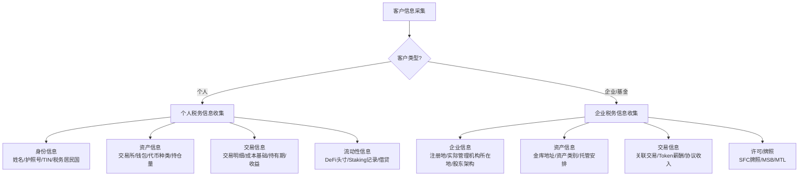

# 跨境加密资产税务规划

## 一、基本信息

### 适用场景

本 Skill 覆盖以下税务规划与合规场景：

| 场景 | 说明 |
|------|------|
| **境内个人加密资产收益申报** | 中国税务居民通过境内/境外交易所、OTC 场外交易、P2P 转账获得的加密资产收益，是否需要申报个人所得税及如何申报 |
| **境外交易所收益申报** | 中国税务居民使用 Binance、Coinbase、OKX、Bybit 等境外交易所进行交易产生的资本利得/收益的税务处理 |
| **DeFi 收益性质认定** | 质押（Staking）、流动性挖矿（Yield Farming）、借贷利息、空投（Airdrop）等 DeFi 收益属于何种应税收入类别 |
| **加密 ETF 基金跨境税务** | 投资海外加密 ETF（如比特币现货 ETF/期货 ETF）的资本利得与股息收入的税务处理，以及 ETF 分红性质的认定 |
| **海外账户 FACTA/CRS 合规** | 中国税务居民在境外持有加密资产及交易所账户的 FACTA/CRS 信息报送义务 |
| **移民场景加密税务** | 移居/移民前后加密资产持有结构的税务优化（登陆前变现 vs 以持有形态入境） |
| **香港虚拟资产税务** | 香港税务居民（个人/公司）从事虚拟资产交易的相关利得税/薪俸税处理（参考 IRD 指引） |

### 目标客户类型

| 客户类别 | 典型画像 | 主要关切 |
|---------|---------|---------|
| **高净值个人投资者** | 中国税务居民，持有 1000 万人民币以上加密资产，分散在 3+ 交易所及自托管钱包 | 个税申报合规、CRS 信息错配风险、移民税务规划 |
| **Web3 从业者** | 中国税务居民，收入来源于海外项目方（代币/股权+Token） | Token 薪酬性质认定、境外收入申报、外汇管制 |
| **加密 OTC 商户** | 撮合个人之间的法币-加密资产兑换，年流水较大 | 经营所得 vs 财产转让所得定性风险、反洗钱合规 |
| **DeFi 协议参与者** | 深度参与 Yield Farming、Liquidity Providing，收入以协议代币结算 | 收益性质复杂（利息/服务费/资本利得混合）、缺乏 1099 等 Tax Form |
| **移民/签证申请人** | 正在申请或已取得海外永居/国籍的中国高净值人群 | 离境清税、登陆后税基成本认定（Step-Up Basis）、FATCA 申报 |
| **加密基金/DAO 金库** | 通过海外架构持有加密资产的投资基金或 DAO 实体 | CFC 规则、PE 风险、Transfer Pricing |

### 适用法域

- **中国大陆（cn-mainland）**：默认法域，以个税法、企业所得税法、外汇管理条例为主
- **香港（hk）**：利得税制、无资本利得税、IRD 虚拟资产指引（2023）
- **美国（配合税收协定分析）**：IRS 加密资产税务指引（Notice 2014-21, Rev. Rul. 2023-14），FATCA 申报

---

## 二、分析框架

### 2.1 加密资产税务性质分类

#### 2.1.1 中国大陆税务定性

中国目前尚未出台专门针对加密资产的税法规定，税务处理遵循一般税法原则。根据财政部、税务总局的现行口径及实务实践，加密资产收益的税务性质认定如下：

| 收益类型 | 税务性质 | 适用税目 | 税率 | 逻辑 |
|----------|---------|---------|------|------|
| **长期持有增值出售** | 财产转让所得 | 个人所得税—财产转让所得（《个人所得税法》第3条） | 20% | 虚拟货币被视为"财产"，买卖价差按财产转让所得征收个税。**实务中自行申报比例极低** |
| **短期高频交易（量化/做市）** | 经营所得（有争议） | 个人所得税—经营所得（《个人所得税法》第2条） | 5%-35%（累进） | 若交易频率、规模、组织化程度达到经营标准，税务机关可能认定为经营所得。目前无明确判例 |
| **挖矿所得** | 经营所得/劳务报酬 | 个税—经营所得或劳务报酬 | 视情况 | 个人挖矿按劳务报酬（3%-45%累进）；机构挖矿计入企业所得税。2021年9月后境内挖矿已被全面清理 |
| **Staking/DeFi 收益** | 定性不明 | — | — | 尚无明文规定，税务处理高度不确定。实务建议保守申报为"其他所得"（20%）或暂不申报 |
| **空投（Airdrop）** | 偶然所得/劳务报酬 | — | — | 视空投目的而定：营销性质空投可能被认定为偶然所得（20%）；为项目贡献的空投可能被认定为劳务报酬 |

**核心不确定性**：中国大陆对虚拟货币的监管基调是禁止交易（9·4公告 + 2021年9月公告），但税务角度并未豁免纳税义务。税务机关在实践中面临"承认交易合法性才能征税"的悖论。

#### 2.1.2 香港税务定性

| 场景 | 税务处理 | 说明 |
|------|---------|------|
| 个人长期持有后出售 | **不征税**（无资本利得税） | 香港不设资本利得税，个人投资性质交易无需缴纳利得税 |
| 个人频繁交易（视为经营） | 利得税 16.5% | 需判断是否构成"Trade"——频率、持有期、融资杠杆、商业动机是判断标准（参考 IRD 2023年3月指引） |
| Staking/DeFi 收益 | 性质取决于是否在经营过程中产生 | 若构成贸易/业务的一部分，需缴纳利得税 |
| 矿业收益 | 利得税 | 一般视为业务收入 |
| 加密 ETF 基金投资 | 股息/利息一般免利得税 | 实体 ETF 股息可能构成香港来源收入 |

#### 2.1.3 美国税务定性（配合税收协定）

IRS 将加密资产定性为**财产（Property）**，适用一般税务原则（IRS Notice 2014-21）：

| 场景 | 税务处理 |
|------|---------|
| 出售/交换/花费加密资产 | 确认资本利得/损失（短期≤1年：普通税率；长期>1年：优惠税率 0%/15%/20%） |
| 挖矿/Staking 获得新代币 | 获得时按 FMV 计入普通收入，出售时再确认资本利得/损失 |
| Airdrop 获得代币 | 获得时按 FMV 计入普通收入 |
| 用加密资产支付工资 | 雇主需代扣代缴薪资税，雇员按普通收入纳税 |
| DeFi 借贷利息 | 按利息收入或服务费收入处理（视协议性质） |

### 2.2 跨境税务关键问题

#### 2.2.1 中国税务居民境外加密资产申报义务

1. **全球所得申报原则**（《个人所得税法》第1条）
   - 中国税务居民（居住满183天/有住所）须就全球所得申报个税
   - 境外加密资产收益（交易所收入、DeFi收益、挖矿收益、空投所得等）均属于申报范围

2. **境外收入抵免**（《个人所得税法》第7条）
   - 已在境外缴纳的所得税（如美国、香港）可申请境外税收抵免
   - 需保留境外完税凭证

3. **外汇管制**（《外汇管理条例》）
   - 境内个人每年5万美元购汇/结汇额度
   - 大额加密资产变现后的法币回流需注意外汇合规

#### 2.2.2 中国居民境外交易所申报

| 申报项目 | 说明 |
|---------|------|
| 个人所得税—财产转让所得 | 交易所变现收益需自行申报（20%税率） |
| 海外金融账户申报（外汇管理局） | 境外银行账户、证券账户余额超过等值5000美元须申报 |
| CRS 信息交换 | 境外交易所信息可能通过 CRS 交换至中国税务机关（取决于交易所所在司法管辖区的 CRS 实施情况） |
| FATCA | 仅适用于美国税务居民/美国金融机构账户；中国居民在美账户受 FATCA 影响 |

**CRS 实操要点**：
- 大部分主流 CEX（Binance、Coinbase、Kraken 等）已实施 CRS 尽职调查
- 客户须申报税务居民身份、税号（TIN）、常住地址
- 中国税局获取 CRS 信息后可能比对申报情况——信息不对称风险较高
- 自托管钱包（Self-Custody Wallet）的链上活动目前不在 CRS 申报范围内，但在税务调查中可能被追溯

#### 2.2.3 中美跨境加密税务问题

| 问题 | 分析 |
|------|------|
| **中国居民投资美国加密 ETF** | ETF 出售的资本利得为中国税务居民的全球所得，需申报个税。美国端没有代扣代缴（非美国居民通常豁免资本利得税） |
| **美国税务居民持有中国交易所账户** | 美国税务居民（公民/绿卡/183天测试）须向 IRS 申报全球收入，同时申报 FBAR（Foreign Bank Account Report） |
| **税收协定优惠（中美）** | 中美税收协定第13条（财产收益）：资本利得一般由居民国征税，来源国不征税。但若涉及常设机构（PE），来源国可征税 |
| **双重征税风险** | 中美之间因加密资产分类不同（财产 vs 货币 vs 商品）可能导致双重征税，需根据具体情况分析税收协定适用性 |

#### 2.2.4 常设机构（PE）风险

| 场景 | PE 风险 |
|------|---------|
| 中国团队在海外部署 DeFi 协议 | 若中国团队成员构成在境内的"固定营业场所"或"代理人"，可能被认定为在中国构成 PE |
| 海外加密基金通过中国团队管理 | 管理团队在中国境内的实质性活动可能导致基金在中国被认定为 PE，面临企业所得税风险 |
| DAO 分散成员中的中国居民 | 若中国居民对 DAO 的经营决策有实质性控制权，可能触发 CFC（受控外国公司）规则或 PE 认定 |

### 2.3 税收协定（DTA）考虑

| 协定条款 | 适用范围 | 对加密资产的影响 |
|---------|---------|-----------------|
| **第13条（财产收益）** | 资本利得的征税权分配 | 加密资产作为"财产"，其出售收益一般由卖方居民国征税（无 PE 情况下） |
| **第7条（营业利润）** | 常设机构利润分配 | 若通过中国 PE 从事加密交易，中国对归属 PE 的利润具有征税权 |
| **第11条（利息）** | DeFi 借贷利息 | 利息来源国可征税（通常不超过10%），取决于协议定性 |
| **第12条（特许权使用费）** | 软件/算法授权收入 | DeFi 协议许可、技术授权费可能适用，来源国可征税（通常不超过10%） |
| **第4条（居民）** | 双重居民身份冲突 | 同时满足中美两国居民条件时，通过"加比规则"（Tie-Breaker）确定唯一居民国 |
| **第23条（消除双重征税）** | 境外税收抵免 | 已在来源国缴税的部分，居民国应给予税收抵免或免税 |

---

## 三、操作流程

### Step 1: 客户信息采集与事实梳理



**采集清单：**

1. **个人客户**
   - [ ] 姓名、护照号/身份证号、税号（TIN）
   - [ ] 税务居民国（中国/香港/美国/其他）
   - [ ] 交易所账户列表及地址（Binance/Coinbase/OKX/Bybit/HTX/其他）
   - [ ] 自托管钱包地址（EVM/Solana/BTC/Tron/其他）
   - [ ] 最近3年的交易明细（CSV导出/API拉取/手动录入）
   - [ ] 成本基础确认（首次购入时间/价格、法币入金记录）
   - [ ] DeFi协议交互记录（Staking/Lending/Yield Farming/Swap）
   - [ ] Airdrop记录
   - [ ] OTC交易记录（支付宝/微信/银行流水）
   - [ ] 已申报记录（如适用）

2. **企业/基金客户**
   - [ ] 公司注册文件（注册地、实际管理机构）
   - [ ] 股东/受益人结构（UBO）
   - [ ] 加密金库地址及持仓快照
   - [ ] 资产负债表中的加密资产科目
   - [ ] 关联交易合同（咨询费/技术服务费/Token协议）
   - [ ] 已申报的税务报表（如适用）
   - [ ] 许可/牌照文件

### Step 2: 交易数据整理与成本基础计算

**数据整理工具：**
- 建议使用 Koinly / CoinTracking / CryptoTax 等自动化工具进行交易数据合并
- 手工整理：导出各交易所 CSV → 合并清洗 → 按 FIFO/LIFO/特定标识法计算成本基础

**成本基础方法选择：**

| 方法 | 说明 | 适用场景 |
|------|------|---------|
| FIFO（先进先出） | 最早购入的代币视为最早出售 | 中国税法未明确规定，实务中最保守，建议优先采用 |
| LIFO（后进先出） | 最近购入的代币视为最早出售 | 节税效果更强，但合规风险更高 |
| Specific Identification | 指定具体哪一批代币出售 | 纳税人有完整记录时适用 |

**链上交易分析：**
- 使用 Etherscan/BscScan/Solscan 等浏览器的 API 拉取链上历史
- 注意合并地址（一个用户可能有数十个地址）
- 区分：Swap（应税事件）、Transfer（非应税事件）、Stake Deposit/Withdraw（非应税事件，但发放奖励为应税事件）

### Step 3: 税务性质认定

根据 Step 1 采集的客户交易行为和 Step 2 处理的交易数据，判断各笔收益的税务性质：

| 收益类型 | 认定依据 | 判断要点 |
|---------|---------|---------|
| 交易所买卖价差 | 财产转让所得 | 买入成本 vs 卖出对价，计算净收益 |
| DeFi 流动性挖矿 | 利息/服务费收入（有争议） | LP Token 价值变动 + 手续费收入 |
| Staking 奖励 | 普通收入（IRS）/其他所得（中国） | 获得时的 FMV（公允价值） |
| 借贷利息 | 利息所得 | 按 DeFi 协议约定的利率 × 时间 |
| Airdrop | 偶然所得/普通收入 | 是否与前期贡献相关 |
| NFT 交易 | 财产转让所得 | 非同质化，注意市场稀缺性导致的税务认定困难 |
| 空投 NFT | 偶然所得 | FMV 认定困难 |
| Mining 收益 | 经营所得/劳务报酬 | 需区分个人挖矿和机构挖矿 |

### Step 4: 计算应纳税额

**中国大陆税务计算（以个人为例）：**

```
应税所得 = Σ（各笔交易的卖出对价 - 买入成本）- 可抵扣费用

应纳税额 = 应税所得 × 20%（财产转让所得）
或：
应纳税额 = 应税所得 × 适用累进税率（经营所得）

境外税收抵免：min(境外已缴税款, 中国应纳税额 × 境外收入占比)
```

**注意事项：**
- 加密资产之间的兑换（ETH→USDC）属于应税事件，需确认损益
- 不能仅计算提现至法币的金额，须按每个交易事件分别计算
- 亏损可在当年抵扣，但不得跨年结转（中国税法对财产转让所得亏损的处理不明确）
- 同一税年内的盈利和亏损可以互抵（Netting）

### Step 5: 申报与信息报送

#### 中国大陆申报

| 申报事项 | 填报时点 | 操作说明 |
|---------|---------|---------|
| 个人所得税综合所得汇算清缴 | 每年3月-6月 | 通过个税APP申报劳动报酬/经营所得 |
| 财产转让所得申报 | 年度汇算清缴 | 填写《个人所得税年度自行纳税申报表》，在"财产转让所得"栏填报加密资产收益 |
| 境外所得申报 | 年度汇算清缴 | 填写《境外所得个人所得税抵免明细表》 |
| 大额交易报告 | 单笔等值5万美元以上 | 银行及支付机构会提交大额交易报告 |
| 反洗钱报告 | 交易所合规要求 | 通过法币通道提现超过一定金额可能触发银行反洗钱问询 |

#### CRS/FATCA 申报

| 申报类型 | 适用对象 | 申报内容 |
|---------|---------|---------|
| CRS（共同申报准则） | 境外金融机构自动交换 | 账户余额、账户持有人信息 |
| FATCA | 美国金融机构或美国账户 | 美国纳税人账户信息 |
| FBAR（外国银行账户报告） | 美国税务居民（FinCEN 114） | 境外金融账户余额超过 $10,000 |

### Step 6: 税务筹划建议

根据分析结果，提供以下类型的筹划建议：

1. **持有结构优化**
   - 是否需要在境外设立 SPV 持有加密资产
   - 代持结构的税务风险分析
   - 信托/基金会持有加密资产的税务影响

2. **TP（转让定价）规划**（企业客户）
   - 关联交易定价合理性分析
   - Token 薪酬 Transfer Pricing 文档准备

3. **移民税务规划**
   - 移民前后的税法适用变化
   - 登陆前变现 vs 登陆后变现的税负差异
   - 美国绿卡/公民税务规划（Estate Tax 考虑）

4. **合规性指导**
   - 历史未申报收入的补救方案（Voluntary Disclosure）
   - 与税务机关沟通的策略
   - 会计师事务所选择建议（具有加密税务经验）

### Step 7: 输出报告模板

```
【跨境加密资产税务分析报告 v1.0】

一、客户概要
  - 姓名/公司名：[保密处理]
  - 税务居民国：[中国/香港/美国]
  - 主要资产规模：[范围]
  - 涉及交易所/钱包：[列表]

二、税务分析结论
  - 总体税务风险等级：[高/中/低]
  - 主要风险点：[如CRS申报不一致/收益未申报/外汇合规]
  - 预估未申报税负：[金额范围]

三、分类分析
  | 收入类型 | 金额(USD) | 认定为 | 适用税率 | 应纳税额 |
  |---------|-----------|-------|---------|---------|
  | 交易所交易 | X | 财产转让所得 | 20% | Y |
  | DeFi收益 | X | 其他所得(建议) | 20% | Y |
  | Staking奖励 | X | 普通收入 | 累进 | Y |
  | Airdrop | X | 偶然所得 | 20% | Y |

四、跨境考量
  - 境外税收抵免情况：[已缴/未缴]
  - CRS/FATCA合规建议：[内容]
  - 外汇管制提示：[内容]

五、税务筹划建议
  - 短期：历史未申报补救
  - 中期：持有结构优化
  - 长期：移民税务安排

六、免责声明
  - 本报告不构成正式法律意见
  - 建议结合专业税务律师意见使用
  - 税法和监管政策可能随时变化
```

---

## 四、升级决策门

### 强制升级标准

出现以下情形，**立即停止分析并移交专业刑事/税务律师**：

| 触发条件 | 风险等级 | 原因 |
|---------|---------|------|
| 涉及非法集资罪（刑法第176条） | 🔴 刑事 | 以加密资产为名募集资金、承诺保本付息、承诺固定回报 |
| 涉及组织、领导传销活动罪（刑法第224条之一） | 🔴 刑事 | 拉人头、多层返利、动态收益机制 |
| 涉及洗钱罪（刑法第191条） | 🔴 刑事 | 明知资金为犯罪所得仍提供加密资产转换/转账服务 |
| 涉及开设赌场罪（刑法第303条） | 🔴 刑事 | 以加密资产为筹码建立赌池、链上博彩协议 |
| 涉案金额特别巨大（>1000万人民币） | 🟠 高 | 税务机关或公安机关可能主动介入调查 |
| 涉及跨境执法（美国SEC/OFAC/DOJ） | 🔴 刑事 | 可能涉及美国经济制裁、证券法违规，中美双重执法风险 |
| 客户为美国SDN名单/特别指定国民 | 🔴 刑事 | 涉及OFAC制裁风险，银行/交易所合规红线 |
| 客户已收到税务机关/公安机关调查通知 | 🔴 刑事 | 已进入行政执法/刑事调查程序 |
| 涉及未申报的境外大额账户（>等值100万美元） | 🟠 高 | CRS信息匹配后可能触发税务稽查 |
| 涉及加密资产用于税务欺诈/逃税且金额巨大 | 🟠 高 | 故意逃税（Tax Evasion）与过失未申报（Tax Non-Compliance）性质不同 |

### 建议咨询专业律师的情形

以下情形虽不强制升级，但强烈建议出具报告前咨询专业律师：

| 情形 | 原因 |
|------|------|
| DeFi 收益金额超过 500 万人民币且持续产生 | 税务性质认定高度不确定，税务机关未来可能追溯 |
| 涉及代币发行/ICO/IDO/IEO 等融资行为 | 可能触及证券法（中国证监会境外管辖延伸） |
| 涉及 DAO 治理 Token 的薪酬设计 | 劳动法+税务法交叉问题 |
| 客户同时为中国/美国双重税务居民 | 税收协定适用复杂，中美申报义务交叉 |
| 涉及 OFAC 制裁地区（伊朗/朝鲜/俄罗斯/古巴等）交易对手方 | 即使非故意制裁合规风险极高 |
| 客户用加密资产在境外购买不动产 | 外汇管制 + 目标国税务申报问题 |
| 涉及加密资产遗产/继承/Estate Planning | 加密资产继承的法律效力与税务处理 |
| 客户正在申请海外签证/移民（特别是 EB-5/E-2/O-1 等需要披露资产来源的签证） | 加密资产来源的合规性可能影响签证审批 |

### 升级操作流程

```
触发升级条件
    │
    ▼
记录触发要素（客户ID、触发条件、金额范围、证据位置）
    │
    ▼
准备移交材料：
  ├─ 现有分析草稿（标注到中断点）
  ├─ 触发升级的具体条款引用
  ├─ 客户基本信息（脱敏或脱敏前视情况）
  └─ 风险评估摘要（1页以内）
    │
    ▼
移交至：[专业刑事/税务律师团队]
    │
    ▼
律师评估后反馈：
  ├─ 可继续分析（律师给出指导意见）
  ├─ 需暂停并另行委托律师介入（客户单独委托）
  └─ 建议客户自首/自愿披露（涉及刑事风险）
    │
    ▼
更新本skill文档中的升级记录
```

### 升级后总结记录

每次升级均应记录以下要素（用于持续改进升级阈值）：

- 触发时间
- 触发条件
- 客户类型（脱敏）
- 涉及金额范围
- 最终处理结果
- 升级决策准确性评估（过分谨慎/合理/遗漏风险）
